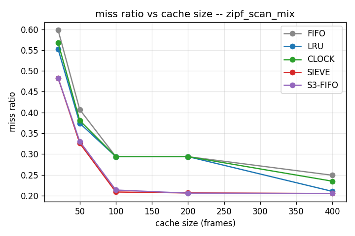
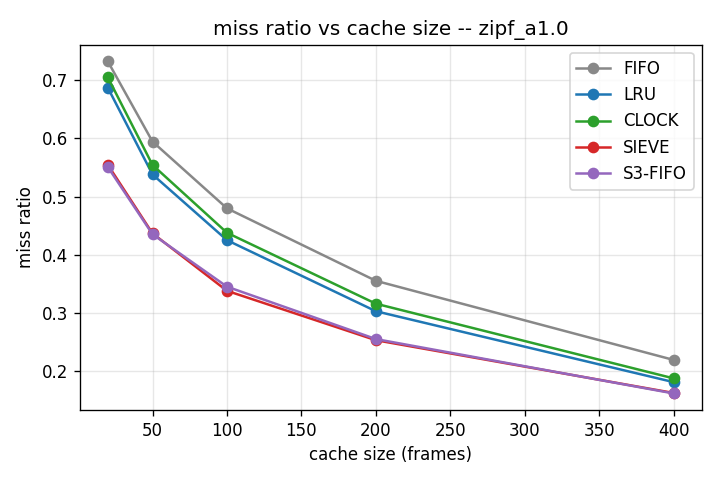
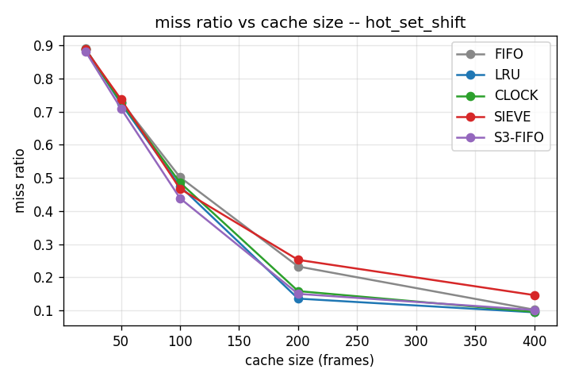

# Pluggable Buffer Pool Manager with Modern Eviction Policies

A database **buffer pool manager** in C++17 — the component that caches fixed-size disk pages in
memory — with **five pluggable eviction policies**, benchmarked against each other:

| Policy | Idea | Origin |
|---|---|---|
| **FIFO** | evict the oldest inserted page | baseline |
| **LRU** | evict the least recently used page | textbook |
| **CLOCK** | LRU approximation: circular buffer + reference bits | what PostgreSQL actually uses |
| **SIEVE** | one FIFO queue + a persistent hand + a visited bit (lazy promotion) | [NSDI '24](https://cachemon.github.io/SIEVE-website/) |
| **S3-FIFO** | small (10%) + main (90%) + ghost queues; one-hit-wonders never reach main | [SOSP '23](https://s3fifo.com) |

Pages live in a **simulated disk** (a real file, addressed as fixed 4 KB pages at
`page_id * 4096`). The pool holds N frames in **one** preallocated `std::vector<char>` of
`N * 4096` bytes, with an `unordered_map` page table mapping `page_id -> frame index` and
pin/unpin semantics (a pinned page is never evicted). The metric that matters is **miss ratio** —
i.e. disk I/Os avoided.

Standard library only. No Boost, no threads, no networking, no `new`/`delete`, no smart pointers:
all frames and policy nodes are preallocated in `std::vector`s and linked by **integer index**
(`int prev, next;` with `-1` as null).

> **Status: complete.** All five policies implemented, tested against hand-computed
> eviction traces, and benchmarked. See [PROJECT_TRACKER.md](PROJECT_TRACKER.md) for the
> design decisions and [results/summary.md](results/summary.md) for the full tables.

## Build and run (3 commands)

Requires **g++ (MinGW-w64)** on PATH — this repo is developed with MSYS2 UCRT64 g++ 13.1.0 at
`C:\msys64\ucrt64\bin`. **CMake is not required** (and is not installed here).

```powershell
.\build.ps1                    # 1. compile both binaries with -O2, then run the tests
.\build\runner.exe             # 2. run the benchmarks  -> results\results.csv
.\venv\Scripts\python plot.py  # 3. CSV -> PNGs + results\summary.md
```

Step 3 uses the venv at `venv/` (create once with `python -m venv venv`, then
`.\venv\Scripts\python.exe -m pip install matplotlib`).

`build.ps1` is just a wrapper around two g++ calls. The raw fallback, if you prefer:

```powershell
g++ -O2 -std=c++17 -Wall -Wextra -Iinclude src\*.cpp bench\runner.cpp    -o build\runner.exe
g++ -O2 -std=c++17 -Wall -Wextra -Iinclude src\*.cpp tests\run_tests.cpp -o build\run_tests.exe
```

**`-O2` matters**: the ops/sec micro-benchmark measures per-policy CPU overhead, and those numbers
are meaningless in an unoptimized build. All reported ops/sec figures use `-O2`.

If you would rather use CMake, `CMakeLists.txt` is committed and works:

```powershell
cmake -S . -B build -DCMAKE_BUILD_TYPE=Release && cmake --build build
```

Tests are a single self-contained `tests/run_tests.cpp` with a hand-rolled `CHECK` macro and a
pass/fail count — no GoogleTest, no Catch2. It exits non-zero on failure.

## Repo layout

```
include/
  policy.h            EvictionPolicy abstract base: on_access / on_insert / evict / name
                      + pin tracking shared by all policies
  disk_manager.h      simulated disk: 4 KB pages via fstream, counts every read/write
  buffer_pool.h       frames, page table, pin counts, hit/miss stats
  policies/           fifo.h lru.h clock.h sieve.h s3fifo.h   (header-only)
src/
  disk_manager.cpp  buffer_pool.cpp
bench/
  traces.h/.cpp       Zipfian / sequential-scan / hot-set-shift generators
  runner.cpp          sweeps workloads x policies x cache sizes -> results.csv
tests/
  run_tests.cpp       hand-computed expected evictions per policy + invariants
plot.py               the only Python: CSV -> miss-ratio-vs-cache-size PNGs + summary.md
results/              results.csv, PNGs, summary.md, and the *.db disk files
```

## What the benchmarks measure

6 workloads × 5 policies × 5 cache sizes = 150 combinations, 20 000 requests each over a
1000-page key space. Every combination is measured twice: once with real disk I/O (miss
ratio) and once with I/O disabled (ops/sec, isolating policy CPU overhead).

- **Miss ratio vs. cache size** — one chart per workload, all five policies overlaid.
- **Ops/sec** — disk disabled, so this is purely policy bookkeeping: SIEVE's hand walk vs.
  LRU's list splice on *every* hit.

## Results

### Scan resistance — the headline



Zipfian hot traffic interrupted by periodic 200-page sequential scans. At cache = 200
frames, **FIFO, LRU and CLOCK collapse to a byte-identical 14127 hits / 5873 misses**
(0.2937): a 200-page burst flushes a 200-frame cache completely, so all three degrade to
exactly the same behaviour. SIEVE (0.2065) and S3-FIFO (0.2059) hold on by
quick-demoting the one-hit-wonder scan pages — a **~30 % lower miss ratio**, and within a
hair of the ~0.20 theoretical floor (20 % of requests are scan pages that can never hit).

### Skewed (Zipfian) access



SIEVE and S3-FIFO beat LRU at **every** cache size on all three α values — e.g. at α = 1.0,
cache = 100: SIEVE 0.3380 and S3-FIFO 0.3452 vs. LRU 0.4250 (**~20 % fewer misses**). This
reproduces both papers' central claim.

### Where SIEVE loses — a working set that moves



The one place SIEVE is beaten, and the most interesting result here. On a **static**
uniform hot set SIEVE is excellent (0.0924 at cache = 200, beating LRU's 0.1103). Make that
same hot set **shift** every 4000 requests and SIEVE degrades to 0.2526 while LRU only
moves to 0.1356 — worse even than plain FIFO.

This is lazy promotion's bill coming due, not a bug. SIEVE never reorders on a hit, so
pages that were hot but have gone cold keep `visited = 1` and stay exactly where they are;
the hand must lap the queue *twice* to purge them (once to clear each bit, once to evict).
LRU reorders on every access, so a stale page drifts to the LRU end and dies immediately.
S3-FIFO (0.1499) is largely immune — its ghost queue gives it a re-admission path that
adapts. The papers evaluate on skewed, fairly stable web-cache traces, which is precisely
the regime where this weakness doesn't surface.

### Pure sequential scan

Every policy sits at a **1.0000 miss ratio at every cache size** — with a 1000-page scan and
a ≤400-frame cache, a page is always evicted before it comes round again. Correct and
expected, and the reason `zipf_scan_mix` exists: a pure scan has no hot set to pollute, so
it cannot demonstrate scan *resistance*.

### Policy overhead (ops/sec, disk disabled, -O2)

| FIFO | SIEVE | CLOCK | LRU | S3-FIFO |
|---|---|---|---|---|
| 9.1 M | 8.7 M | 7.6 M | 7.5 M | 5.8 M |

SIEVE is ~16 % faster than LRU: a hit is a single bit write, where LRU unlinks and relinks
a node on every hit. S3-FIFO is slowest — three queues plus a ghost hash lookup per miss —
which is the price of its scan resistance. FIFO is fastest because a hit does nothing at
all.
